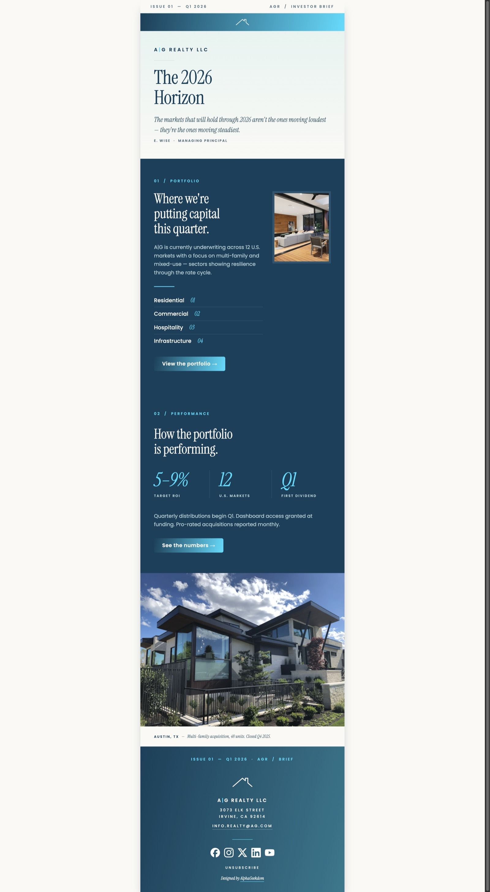
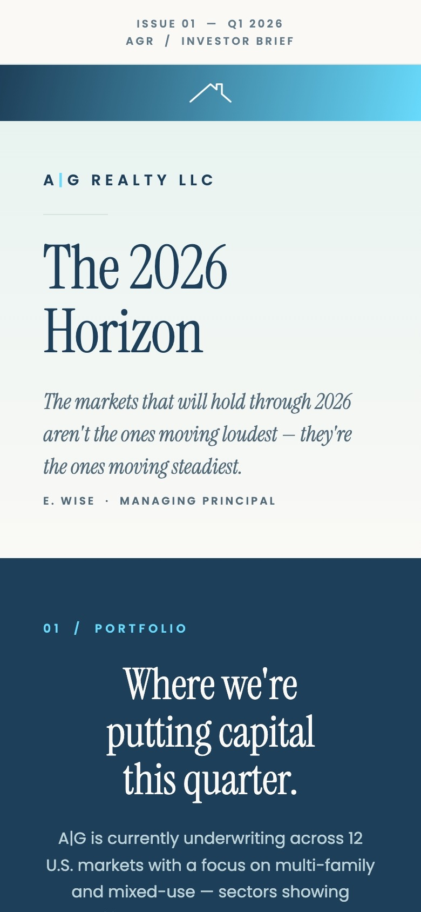
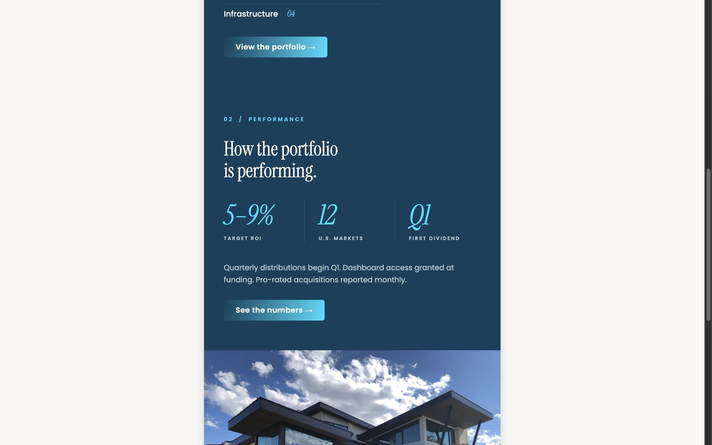
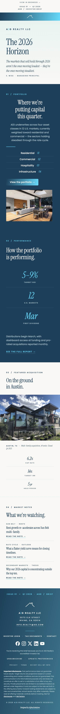

# A|G Realty — The 2026 Investor Briefing



A bulletproof HTML email designed as Issue 01 of a fictional quarterly investor briefing from A|G Realty. Built as a self-contained portfolio piece demonstrating editorial design thinking, typographic hierarchy, and cross-client email engineering — where every styling decision has to survive Gmail, Apple Mail, and Outlook simultaneously.

**Live preview:** [ag-realty.netlify.app](https://ag-realty.netlify.app)

## Case study

The piece uses a hybrid editorial / finance aesthetic — dual-font typography (Instrument Serif for display, Poppins for body), a numbered section structure borrowed from quarterly print publications, and a restrained cyan-on-navy palette.

The masthead opens with a quote-as-standfirst — *"The markets that will hold through 2026 aren't the ones moving loudest — they're the ones moving steadiest"* — anchoring the editorial voice before any section content lands. What started as a separate pull-quote section was folded into the masthead late in development. The numbered structure went through two restructures: first compressed from three rows to two (Portfolio absorbing the four-category asset list, Performance keeping the three-up stat grid), then expanded back to four — adding **03 / Featured Acquisition** as a deal-card (cap rate, target IRR, hold period) and **04 / Market Notes** as a short editorial link list. Each pass traded length for purpose: every section earns its place.



The signature typographic moment is the three-up performance grid: oversized italic serif numerals (`5–9%` / `12` / `Q1`) in cyan over navy, divided by thin teal vertical rules. On mobile the layout inverts — the vertical rules disappear and horizontal ones take their place, separating each stacked stat.



## Technical approach

- **XHTML 1.0 Transitional** with VML + Office namespaces for Outlook rendering parity
- **MSO conditional stylesheets** for Outlook font fallbacks (Georgia substituting Instrument Serif)
- **Bulletproof structure**: presentation tables, inline styles, solid `bgcolor` fallbacks behind every gradient surface (top banner, masthead, footer), and a VML `<v:roundrect>` + `<w:anchorlock />` primary CTA for Outlook
- **Responsive cascade**: 600px container → 480px at ≤600px → 100% at ≤480px, with utility classes (`.dw`, `.db`, `.stack-gap`, `.stat-grid-col`, `.deal-metric`) handling column stacking and divider-to-border transitions on mobile
- **Dual-branch CTA pattern**: MSO branch renders via VML; non-MSO branch is a styled `<a>` with a `.cta-lift` hover wrapped in `@media (hover: hover)` — progressive enhancement that surfaces on the Netlify preview and degrades silently everywhere email clients render
- **One primary CTA, density elsewhere**: a single primary button (`View the portfolio →`); supporting actions are text links (`See the full report →`, per-note `Read the note →`). Link density lives in the disclosure stack, not in calls to action



## Accessibility & craft

- WCAG AA contrast across the email — body copy on navy at 7.34:1; muted slate unified to `#4a6a7a` (5.49:1 on cream); footer gradient endpoint muted to `#1a7a90` so white text stays legible across the full gradient
- Meaningful alt text on all images and `aria-label` on the Featured Acquisition banner anchor; explicit `width` / `height` attributes for Outlook layout
- View-in-browser fallback at the top of the email for render-failure clients
- Investor-grade disclosure stack in the footer: past-performance, forward-looking-statements, and Reg D accredited-investor language with deep links to full disclosures and risk factors
- CAN-SPAM / GDPR baseline: physical postal address, sender identification, Unsubscribe paired with Update Preferences, recipient-context line ("you're receiving this because…")
- Plain-text fallback in `index.txt`

## Targeted clients

Engineered for the broadest realistic client matrix: Gmail (web, iOS, Android), Apple Mail (macOS, iOS), Outlook 365 (web), Outlook desktop / Word engine, and Yahoo Mail — addressed via MSO conditional comments, Arial/Georgia font substitution, VML `<v:roundrect>` + `<w:anchorlock />` CTA, table-attribute widths, `mso-line-height-rule: exactly`, `.ExternalClass` fix, and Gmail/iOS blue-link overrides.

## Tech stack

No framework, no preprocessor, no build step. A single `index.html` at repo root, email assets in `img/`, plain-text fallback in `index.txt`, documentation screenshots in `screenshots/`.

## Running locally

```sh
open index.html
```

## Disclaimer

A|G Realty is a fictional brand created as an HTML email development project. No investment product, company, offering, or accredited-investor program referenced in this email is real. The disclosure stack, target returns, and Reg D / forward-looking-statement language are included to demonstrate the editorial and compliance conventions of investor communications — not to represent any real offering.
